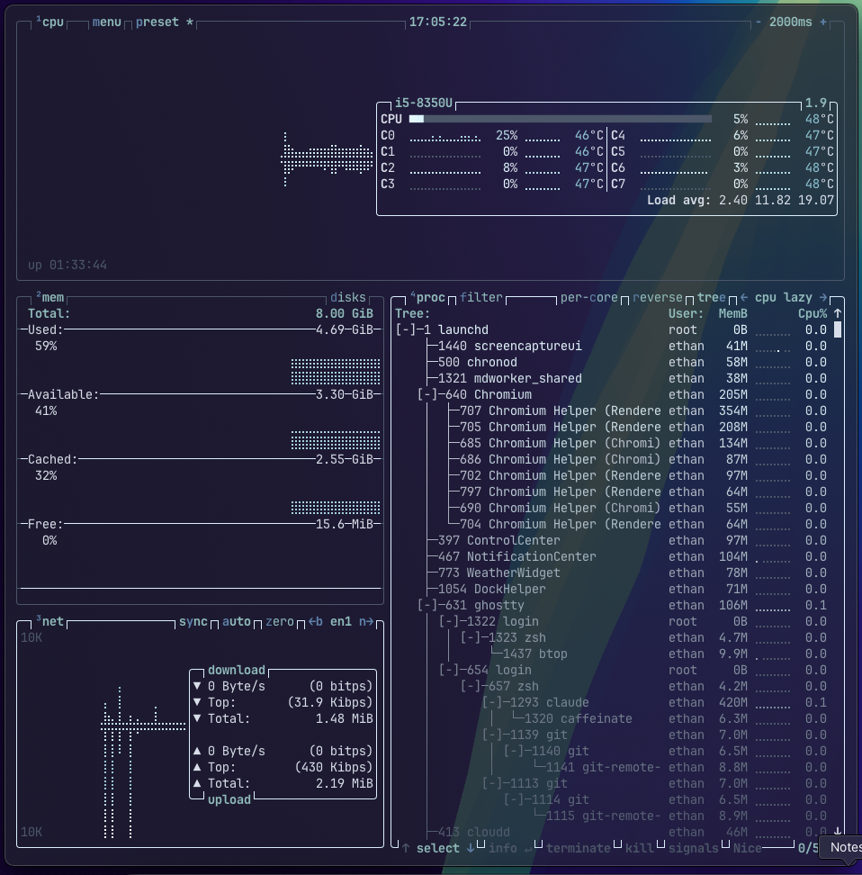

<div align="center">

<h1>tammee Cool White Blue</h1>

<p>A clean, icy <a href="https://github.com/aristocratos/btop">btop</a> theme inspired by snow and arctic skies or something idk — built on a cool Nord-style palette.</p>



</div>

---

## Color Palette

| Swatch | Hex | Used For |
|--------|-----|----------|
|  | `#ECEFF4` | Selected item text |
|  | `#D8DEE9` | Main text |
|  | `#DEF0FF` | Box outlines & dividers |
|  | `#E5F9FF` | Graph low |
|  | `#8FBCBB` | Box titles |
|  | `#88C0D0` | Graph mid |
|  | `#5E81AC` | Highlights & keybinds |
|  | `#4C566A` | Selected background & inactive |

---

## Installation

> Installs the theme by replacing your btop config directory. **This will overwrite any existing btop config.**

```bash
cd ~
sudo rm -rf ~/.config/btop
sudo mkdir ~/.config/btop
sudo git clone https://github.com/tame-t/tammee-btop-themes ~/.config/btop
```

After cloning, open btop and set the theme:

1. Press `ESC` to open the menu
2. Go to **Options**
3. Under **Color theme**, select `tammee-CoolWhiteBlue`

---

## What Gets Installed

```
~/.config/btop/
├── btop.conf                       # Pre-configured btop settings
└── themes/
    └── tammee-CoolWhiteBlue.theme  # The theme file
```

---

<div align="center">

Made by **tammee**

</div>
